## Object Detection in an Urban Environment  

### Project overview
This project is to perform object detection in urban environment using waymo dataset. Object detection is critical component because it would allow the self-driving car to manoeuvre safely and smoothly. This report will detail the setup of the project, study of the dataset and experiment conducted to improve the detection performance of the model.  

### Set up
To run the project,
1. Clone the project starter from 
     * https://github.com/udacity/nd013-c1-vision-starter
2. Install appropriate cuda & cuDNN version. This project was ran with cuda 10.1 , cuDNN 7604, Nvidia Drivers 495.29.05, ubuntu 18.04
3. Follow the instruction to build folder to build the docker image
4. Start the docker image using the instruction in the build folder
5. Download the dataset from waymo's Google Cloud bucket using 
     * cd to project folder from from the bash terminal in docker
     * python download_process.py --data_dir data
6. Downgrade pyparsing by using the follow command if there is any issue due to pyparsing
     * pip install pyparsing==2.4.2 
  

### Dataset
#### Dataset analysis
The dataset contain data with different lighting (Day & Night), weather condition (Sunny and Rainy) and traffic condition(Heavy & Light) The anotated data contains object of class car, pedestrian and cyclist. They are denoted with red, green & blue bounding box respectively.
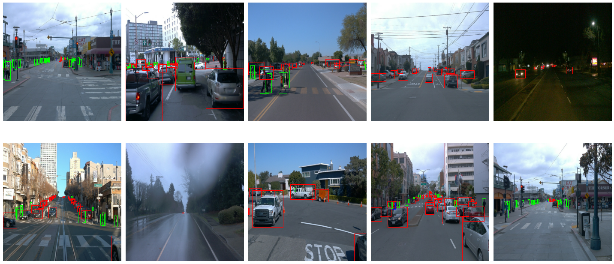

##### Fig 1. 10 dataset samples 

Based on a sample of 50000 data from the dataset. The data distribution is as follows.  

Majority of the detection are of the CAR class. There are relatively little data for CYCLIST class in the dataset
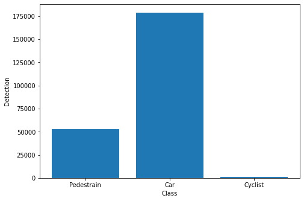

##### Fig 2. Total number of annotated object for each class

The analysis shows that the number of car detected in a camera frame in the dataset should mostly be within 0 to 40.  
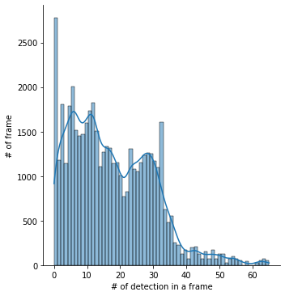

##### Fig 3. Distribtion of Car detection

The analysis shows that the number of pedestrian detected in a camera frame in the dataset should mostly be within 0 to 10.  
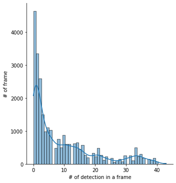

##### Fig 4. Distribtion of Pedestrian detection

The analysis shows that the number of pedestrian detected in a camera frame in the dataset should at most be 5 and mostly be zero  
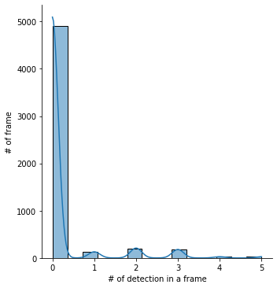

##### Fig 5. Distribtion of Cyclist detection
  

#### Cross validation
To prepare the dataset for training
  1. The dataset is first shuffle to ensure that the train/eval/test set will have different kind of data
  2. The dataset will be split in to 80% training set, 10% evaluation set and 10% testing set. This split is selected as the dataset is large enough. 
    

### Training
#### Reference experiment
The reference experiement is ran the following config.  
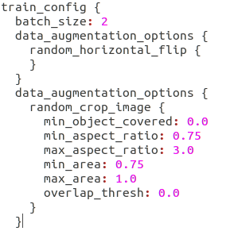

##### Fig 6. Config for reference experiment

  

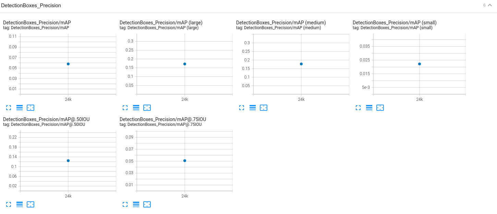

The performance is as follows: \
Loss/classifcation_loss: 0.382 \
Loss/localization_loss: 0.3892 \
Loss/regularization_loss: 0.5337 \
Loss/total_loss: 1.233 \
Learning_rate: 0.0   

##### Fig 7. Performance metrics Precision 

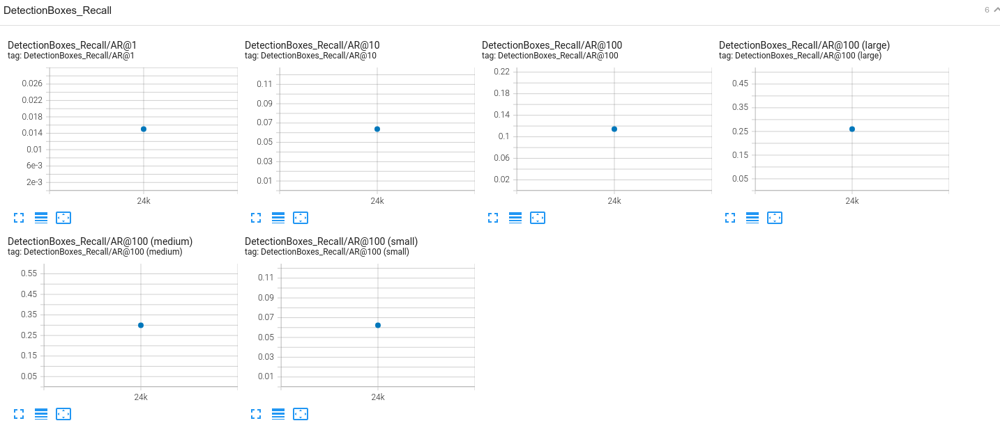

##### Fig 8. Performance metrics Recall 

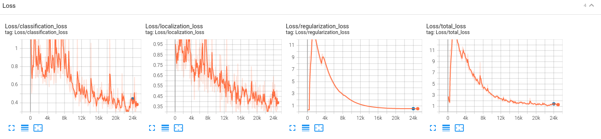

##### Fig 9. Performance metrics loss

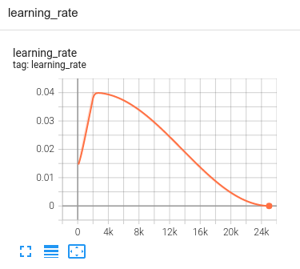

##### Fig 10. Learning rate

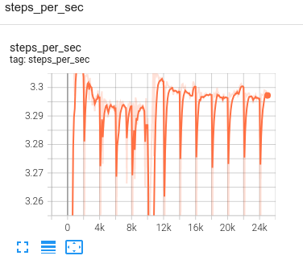

##### Fig 11. Step per second

  

#### Improve on the reference
To improve on the performance, more experiment are conducted and this is experiment ran with the following config yield the best performance.  

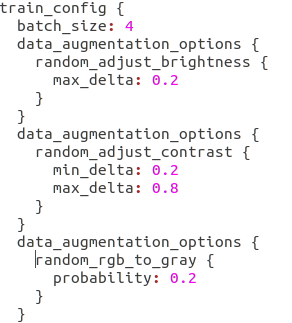  

##### Fig 12. Config for reference experiment 

These augmentations are added to handle the varying lighting condition due to the time of the day and weather condition.  

The performance is as follows: \
Loss/classifcation_loss: 9.7399e-4 \
Loss/localization_loss: 5.1107e-4 \
Loss/regularization_loss: 0.1045 \
Loss/total_loss: 0.1106 \
Learning_rate: 0.0   

The model is observed to have improved according to the above loss metrics.

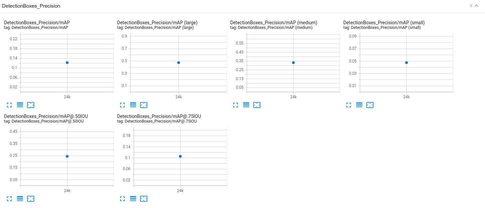

##### Fig 13. Performance metrics Precision 

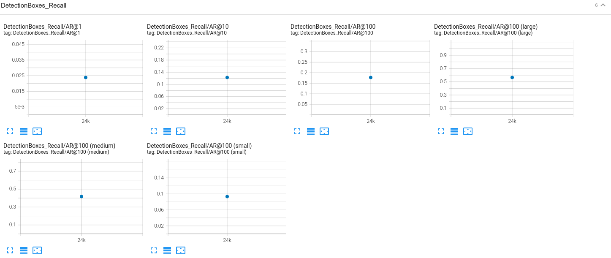

##### Fig 14. Performance metrics Recall 

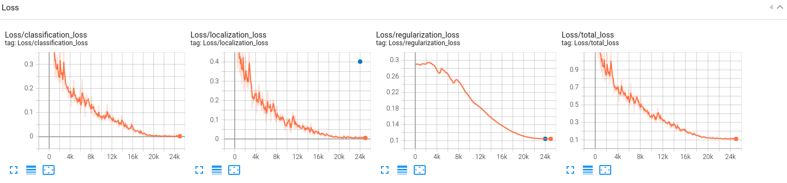

##### Fig 15. Performance metrics loss

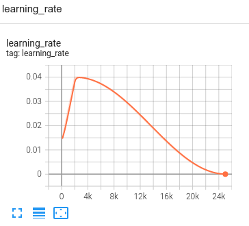

##### Fig 16. Learning rate

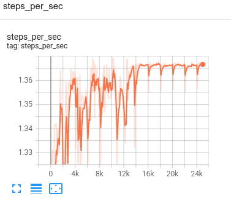

##### Fig 17. Step per second

  
